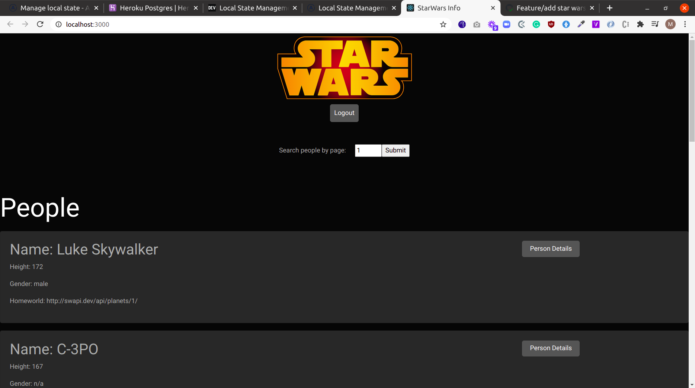

### star-wars-info

This project is a wrapper information site for the official [stars wars API](https://swapi.dev/), built using Apollo GraphQL server and React client.




## Built With
- React
- Typescript
- GraphQL
- Nodejs


## Description

This project is a wrapper information site for the official [stars wars API](https://swapi.dev/), built using Apollo GraphQL server and React client.

## Run server locally
Clone the git repo and inside the project root folder in the terminal run:

```
cd client
yarn build-deploy
cd server
yarn install
yarn server
```


## Authors

👤 **Marylene Sawyer**
- Github: [@Bluette1](https://github.com/Bluette1)
- Twitter: [@MaryleneSawyer](https://twitter.com/MaryleneSawyer)
- Linkedin: [Marylene Sawyer](https://www.linkedin.com/in/marylene-sawyer-b4ba1295/)


# Acknowledgements

- The content in this repository was retrieved from or inspired by the following sites
  - [Apollo Documentation](https://www.apollographql.com/docs/)
  - [FULL STACK TUTORIAL](https://www.apollographql.com/docs/tutorial/)
  - [GraphQL With React & Apollo Series 1 - 4 ](https://www.youtube.com/watch?v=SEMTj8w04Z8)

## 🤝 Contributing

Contributions, issues and feature requests are welcome!